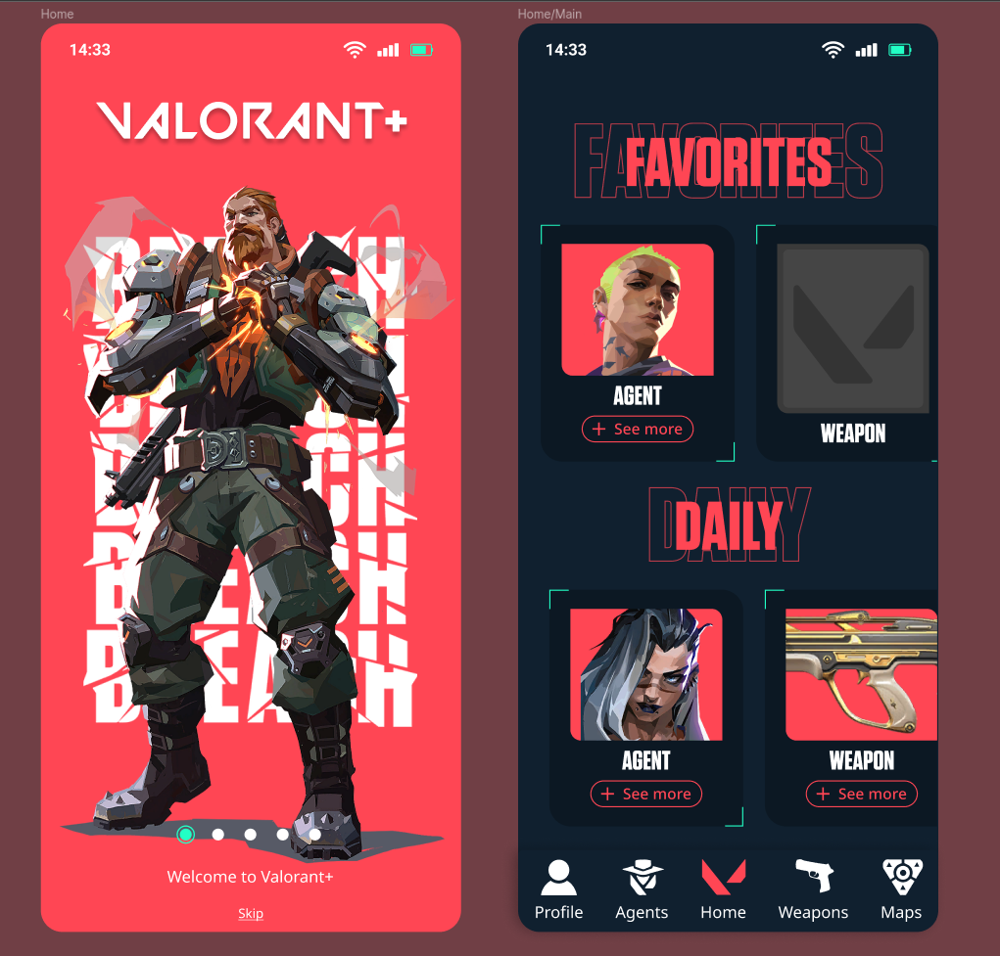

# Bienvenido al repo de Valorant+!

Esta es una aplicación React Native creada como un proyecto universitario para aprender sobre el desarrollo de React Native.

Gracias a la [API de valorant](https://valorant-api.com/) hemos podido utilizar datos reales del videojuego de Valorant para crear la aplicación.



## Diseño

La app fue diseñada en [Figma](https://www.figma.com/) antes del proceso de programación. Se puede visuaizar el figma [aquí](https://www.figma.com/file/ec6oMqkNDg0Q2R8eDOiCgZ/Prototipo-Valorant%2B--Mafia-vfinal?type=design&node-id=245%3A1421&t=bnhH0rvDPixSxNeb-1)

También incluimos en el repositorio una versión del Figma en local, en el archivo llamado `figma.fig`. Puedes ver cómo importar archivos locales [aquí](https://help.figma.com/hc/en-us/articles/360041003114-Import-files-into-Figma)

## ¿Cómo empezar? 🚀

Si estás familiarizado con las aplicaciones de node.js, esto te resultará familiar. Para iniciar un entorno de desarrollo, en su consola ejecute:

```
git clone https://github.com/randreu28/valorant-plus.git
cd valorant-plus && npm i
npm start
```

> ¿Tienes algún problema? revisa la [documentación de expo](https://docs.expo.dev/get-started/installation/)
